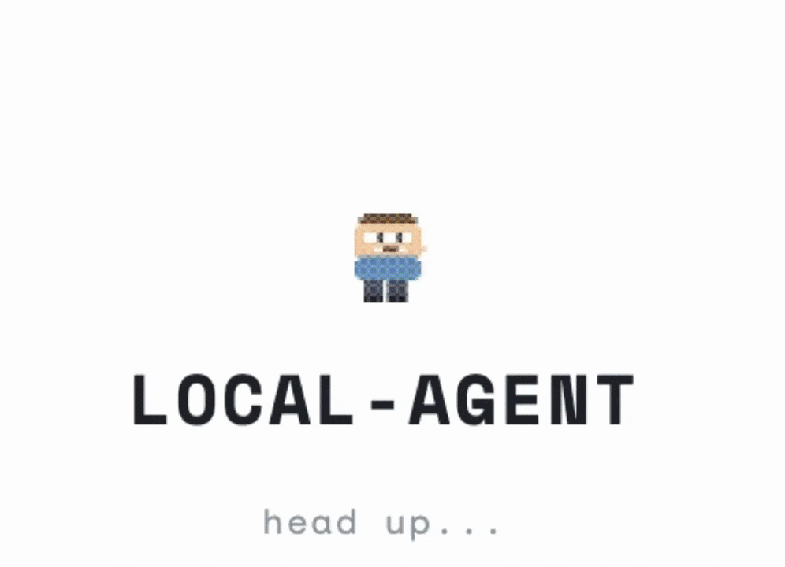

# AutoSwarm

[](https://opensource.org/licenses/MIT)
[](https://github.com/arteemg/autoswarm)
[](https://github.com/arteemg/autoswarm)
[](https://www.python.org/)
[](https://docker.com)

<p align="center">
  <br>
  <a href="https://discord.gg/9ggSRAFGKQ">
    
  </a>
   <br>
  
</p>

> A self-improving OpenAI-compatible proxy for local LLMs, plus a multi-agent pipeline harness that self-optimizes its own topology.

AutoSwarm runs in two modes:

- **Online mode** — drop-in proxy in front of LM Studio / Ollama / vLLM. It logs every chat, then a `reflect` pass distills lessons into a skillbook that gets injected into future system prompts. Skills that turn out to be wrong get pruned automatically.
- **Benchmark mode** — a multi-agent pipeline harness over [Harbor](https://github.com/laude-institute/harbor) tasks. A meta-agent edits stage prompts, tools, turn budgets, and pipeline structure to hill-climb on `passed` tasks.

## Online mode: self-improving local LLM proxy

### Install

```bash
pip install -e .            # editable install from the repo
```

Requires Python 3.12+.

### Start the proxy

```bash
autoswarm doctor            # diagnose local LLM availability
autoswarm start             # auto-detects upstream + model
```

`autoswarm start` probes `:1234` (LM Studio), `:11434` (Ollama), and `:8000` (vLLM) and picks the first one that has a model loaded. Override either with `--upstream` / `--model`. The proxy listens on `http://127.0.0.1:8080`.

Point any OpenAI-compatible client (Chatbox, Open WebUI, your own scripts) at `http://127.0.0.1:8080/v1`. Every chat is logged to `conversations/` and runs through the proxy's skill-injection layer.

### Reflect and prune

```bash
autoswarm reflect           # review unreviewed conversations
```

For each unreviewed conversation, the same upstream LLM is asked whether there's a concrete lesson worth keeping. Novel lessons land in `skills.yaml`. After the add pass, a second judge call reviews the full skillbook against recent conversations and silently removes anything that's wrong, contradictory, or too vague. Output looks like:

```
reviewed=12 added=3 skipped=9 pruned=1
```

For hosted upstreams (OpenAI etc.) pass `--api-key` or set `OPENAI_API_KEY`. Local LLMs need nothing.

### Inspect skills

```bash
autoswarm skills list       # show learned strategies
autoswarm skills clear      # wipe the skillbook
```

### CLI reference

| Command                  | Purpose                                                             |
| ------------------------ | ------------------------------------------------------------------- |
| `autoswarm doctor`       | Probe local LLM servers, print copy-paste fixes                     |
| `autoswarm start`        | Run the OpenAI-compatible proxy on `:8080` with skill injection     |
| `autoswarm reflect`      | Distill lessons from new conversations + prune bad skills (one LLM call per convo, one per run for pruning) |
| `autoswarm skills list`  | Show current skills                                                 |
| `autoswarm skills clear` | Delete `skills.yaml`                                                |

## Benchmark mode

### How it works

- **`pipeline_spec.yaml`** — the topology the meta-agent edits. Defines stages (system prompt, tools, turn budget, output format) and handoffs (token budget, context format) between them. This is the primary edit surface.
- **`pipeline.py`** — the runner. Reads `pipeline_spec.yaml` and executes the pipeline. Contains a small editable section (tool definitions, compression logic) and a fixed Harbor adapter boundary.
- **`evaluator.py`** — per-stage LLM judge. After each run, scores every stage on how well its output equipped the next stage. Produces `stage_scores` for `results.tsv` so the meta-agent can identify exactly which stage is failing.
- **`program_pipeline.md`** — meta-agent instructions. Defines the experiment loop, triage, credit assignment, structural edit rules, and keep/discard criteria.
- **`agent.py`** — single-agent baseline harness for comparison runs.
- **`tasks/`** — evaluation tasks in [Harbor](https://github.com/laude-institute/harbor) format.

The metric is total **passed** tasks. The meta-agent hill-climbs on this score by editing the pipeline topology.


### Running the meta-agent

Point your coding agent at the repo and prompt:

```
Read benchmark/program_pipeline.md and let's kick off a new experiment!
```

The meta-agent will read the directive, inspect `benchmark/pipeline_spec.yaml`, run the benchmark, score each stage with `benchmark/evaluator.py`, edit the topology, and iterate.

### Project structure

```text
pipeline_spec.yaml             -- pipeline topology (primary edit surface)
pipeline.py                    -- pipeline runner + Harbor adapter
  editable section             -- load_spec, tools, compress_handoff, run_task
  fixed adapter section        -- PipelineResult, to_atif, AutoAgent
evaluator.py                   -- per-stage LLM judge
program_pipeline.md            -- meta-agent instructions for pipeline optimization
agent.py                       -- single-agent baseline harness
Dockerfile.base                -- optional base image for custom task Dockerfiles (`FROM autoswarm-base`)
tasks/                         -- benchmark tasks
jobs/                          -- Harbor job outputs (gitignored)
results.tsv                    -- experiment log (gitignored)
run.log                        -- latest run output (gitignored)
```

### pipeline_spec.yaml

This is what the meta-agent reads and edits. Stage-level fields:

| Field           | Description                                                                                                           |
| --------------- | --------------------------------------------------------------------------------------------------------------------- |
| `system_prompt` | Instructions for this stage's agent                                                                                   |
| `tools`         | Tool list — any subset of `run_shell`, `read_file`, `write_file` (register more in `pipeline.py`'s `_TOOL_FACTORIES`) |
| `max_turns`     | Turn budget for this stage                                                                                            |
| `output_format` | Hint to the agent: `bullet_list` \| `json` \| `prose` \| `structured_json`                                            |
| `model`         | Model override (inherits `pipeline.model` if omitted)                                                                 |

Handoff fields between stages:

| Field                | Description                                    |
| -------------------- | ---------------------------------------------- |
| `token_budget`       | Max tokens of context passed to the next stage |
| `format`             | Format hint for context compression            |
| `include_raw_output` | If true, passes full output uncompressed       |

### results.tsv schema

```text
commit  avg_score  passed  task_scores  stage_scores  pipeline_topology  cost_usd  status  description
```

`pipeline_topology` records the stage sequence at time of run — could be `vanilla-agent`, `recon→solve→check`, `plan→execute→verify→execute→verify` (verify-driven retry), or any shape the meta-agent has built — so structural changes are traceable across the experiment log.

### Task format

Tasks follow [Harbor's format](https://harborframework.com/docs/tasks):

```text
tasks/my-task/
  task.toml           -- config (timeouts, metadata)
  instruction.md      -- prompt sent to the agent
  tests/
    test.sh           -- entry point, writes /logs/reward.txt
    test_outputs.py   -- verification (deterministic or LLM-as-judge)
  environment/
    Dockerfile        -- task container image for Harbor
```

## License

MIT
