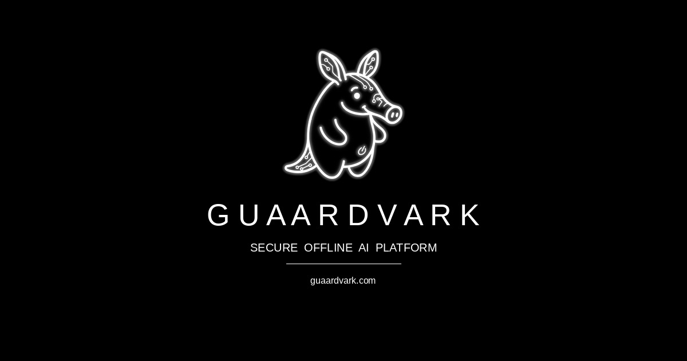

<p align="center">
  
</p>

# Guaardvark

**See the [VERSION](VERSION) file for the current release** · [guaardvark.com](https://guaardvark.com)

The self-hosted, offline-first AI workstation. Autonomous agents that see a real virtual desktop and control apps. A three-tier neural router (AgentBrain). Parallel coding agent swarms in isolated git worktrees. Local video (Wan 2.2, CogVideoX), 4K/8K upscaling, full-song music + neural voice, RAG over your documents, voice chat, and a 70+ tool engine — everything on your hardware. Your machine. Your data. Your rules.

> **For the exhaustive feature list, models, surfaces, and plugin details, see [CAPABILITIES.md](CAPABILITIES.md).** This README focuses on the marquee experience, quick start, and what makes Guaardvark different.

## ▶ Watch Guaardvark build a music video — end to end, on one local GPU

<p align="center">
  <a href="https://www.youtube.com/shorts/rh0LJRK_jAM">
    
  </a>
</p>

<p align="center"><em>Real screen recordings of the system working — click to watch on YouTube.</em></p>

One style prompt and a short narrative, then **go**. Guaardvark wrote every shot prompt, generated the storyboards, rendered the clips, and assembled the cuts — **timing them to the beat after analyzing the song's audio** (`.mp3` / `.wav`). Every frame was generated locally on a single desktop GPU.

> **Full disclosure (every claim here is real):** the glitch effect was the one manual touch, added in Shotcut — Guaardvark did the prompting, generation, beat detection, and assembly. Native filters, transitions, and effects are coming in a future release. The song was made in Suno; Guaardvark's own music + neural-voice generation (including consent-gated voice cloning) is being wired into this pipeline next.

**And media generation is one of the _smaller_ parts of what Guaardvark does** — agent swarms, a coding agent, voice chat, RAG, system mapping, a project manager, a backup system, and a 70+ tool engine are all below.

## Highlights (as of latest release)

- **Video & Audio Production** — Wan 2.2 (T2V + I2V), CogVideoX, SVD; ACE-Step full-song generation with LLM tag polish; Chatterbox/Kokoro neural voice + Piper; explicit consent-gated voice cloning; frame-by-frame 4K/8K upscaling.
- **AgentBrain + Screen Agents** — Reflex/Instinct/Deliberation routing. Agents drive a real Ubuntu/XFCE desktop on a virtual display (`:99`), see with vision models (Gemma4 native `box_2d`), use closed-loop servo targeting, and stream per-step reasoning.
- **Swarm Orchestrator & Film Crew** — Up to 20 parallel agents in isolated git worktrees with dependency-aware merging. Five-role production pipeline (Screenwriter → Casting (LoRAs) → Cinematographer → Storyboard → Editor).
- **Self-Improvement & Safety** — Scheduled/reactive/directed bug detection + agent fixes with verification. Optional "Uncle Claude" (Anthropic) guardian review + codebase lock + Pending Fixes queue. Cross-machine learning via Interconnector.
- **MCP (both directions)** — Stdio MCP server with default-deny policy (desktop/agent/system/browser tools hidden by default). Exposes dozens of tools + read-only output resources. Also calls external MCP servers.
- **Supervised Outreach** — Draft + grade + human-approve pipeline for Reddit (fully wired), Discord/Twitter/Facebook (in flight). Persona, cadence gates, full audit log, kill switch.
- **RAG + Code Intelligence** — Hybrid retrieval, AST-aware code chunking, per-project indexes, repo dependency graphs, `get_repository_map` / `read_ast_node` tools, System Mapper constellation view.
- **GPU Orchestration** — System Resource Orchestrator arbitrates VRAM across plugins (Ollama, ComfyUI, Audio Foundry, etc.). CPU offload, predictive preload, conflict detection.

---

## Marquee Capabilities

**Generation & Editing (all local, no cloud APIs)**
- Text-to-Video / Image-to-Video (Wan 2.2 14B MoE, CogVideoX 2B/5B, SVD-XT) with batch queues, quality tiers, frame interpolation, prompt enhancement, and one-click jump to ComfyUI for custom workflows.
- Audio Studio (Audio Foundry plugin): ACE-Step 3.5B music (vocals or instrumental, Suno-style chips + LLM polish), Stable Audio Open FX/ambience, Chatterbox + Kokoro neural TTS, Piper fallback, consent-gated voice cloning.
- Image gen (Stable Diffusion + batch + face/anatomy controls) + powerful 4K/8K GPU upscaling (Real-ESRGAN family, HAT-L, NMKD, Foolhardy, two-pass, video frame-by-frame).
- Built-in Video Editor (Shotcut-lite 3-lane timeline: video/text/audio, real `ffmpeg drawtext` overlays, drag-and-drop from media library, visual trims, undo, keyboard shortcuts).

**Agents, Automation & Swarms**
- AgentBrain three-tier router (Reflex <100 ms pattern match, Instinct single-shot, Deliberation full ReACT).
- Real-desktop screen agents (Xvfb + XFCE `:99`, Gemma4 vision + closed-loop servo, 45+ deterministic recipes, live per-iteration reasoning stream in chat, draggable VNC viewer everywhere).
- Swarm: parallel agents in isolated git worktrees (Claude Code or fully local Cline/OpenClaw via Ollama), Flight Mode (offline), dependency-ordered merge, cost tracking, up to 20 concurrent.
- Film Crew: 5 specialized agents that turn a logline into a finished video (script → casting with LoRAs → shots → keyframes → edit).
- Self-improvement engine (test → agent fix → verify → broadcast) with guardian review and kill switches.
- Supervised social outreach (Reddit fully working; others drafting+review ready) with persona, grading, cadence, audit, and global kill switch.
- MCP server + client integration (Claude Desktop, Cursor, etc.).

**Knowledge, Code & Workflow**
- Strong RAG (hybrid BM25 + vector, AST code chunking, entity extraction, RAG Autoresearch, per-project isolation).
- Monaco code editor + Code Analyzer + per-repo indexing + dependency graphs + System Mapper (constellation view of the whole codebase).
- Full desktop-grade file/project/client/website/notes/media management with cross-links and recursive indexing.
- Task scheduler (Celery beat), Rules & Prompts (portable bundles), Interconnector for multi-machine clusters (master/client, approval gates, learning broadcast).
- 10+ managed plugins with health checks, port orphan cleanup, and a real GPU Memory Orchestrator.

**Platform & Ops**
- Everything stays on your machine by default. Flight Mode is real and end-to-end tested.
- Plugin system + resource orchestrator so big models don't fight for VRAM.
- Backup/restore (granular or full, schema-migration aware), advanced settings surfaced in UI, live GPU/CPU monitoring.
- CLI (`llx` / PyPI `guaardvark`), browser UI, and MCP.

See [CAPABILITIES.md](CAPABILITIES.md) for the complete enumerated list (models, exact tool counts, plugin manifests, page surfaces, etc.).

---

## Why local?

|                          | Cloud platforms                            | **Guaardvark**                            |
|--------------------------|--------------------------------------------|-------------------------------------------|
| **Where your data lives** | Their servers                              | Your machine. Period.                     |
| **Per-token / per-minute fees** | Always on the meter                  | Free. Generate all night if you want.     |
| **Content policy**        | Their rules                                | Your rules.                               |
| **Custom models / LoRAs** | Whatever they expose                       | Any GGUF, any LoRA, any embedding model   |
| **Works offline**         | No                                         | Yes. Flight Mode tested end-to-end.       |
| **Agents drive a real desktop** | Sandboxed browsers                   | Real Ubuntu/XFCE on your hardware         |
| **Swarms of parallel agents** | Per-task billing scales nastily        | 20 agents in parallel; only cost is power |
| **Multi-machine clusters** | "Talk to sales"                            | Built-in. Master/client, approval gates   |
| **Lock-in**               | Migrate at your own risk                   | It's your computer. Move it whenever.     |

### Why local?

|                          | Cloud platforms                            | **Guaardvark**                            |
|--------------------------|--------------------------------------------|-------------------------------------------|
| **Where your data lives** | Their servers                              | Your machine. Period.                     |
| **Per-token / per-minute fees** | Always on the meter                  | Free. Generate all night if you want.     |
| **Content policy**        | Their rules                                | Your rules.                               |
| **Custom models / LoRAs** | Whatever they expose                       | Any GGUF, any LoRA, any embedding model   |
| **Works offline**         | No                                         | Yes. Flight Mode tested end-to-end.       |
| **Agents drive a real desktop** | Sandboxed browsers                   | Real Ubuntu/XFCE on your hardware         |
| **Swarms of parallel agents** | Per-task billing scales nastily        | 20 agents in parallel; only cost is power |
| **Multi-machine clusters** | "Talk to sales"                            | Built-in. Master/client, approval gates   |
| **Lock-in**               | Migrate at your own risk                   | It's your computer. Move it whenever.     |

[](LICENSE)
[](https://github.com/guaardvark/guaardvark/actions/workflows/ci.yml)
[](https://pypi.org/project/guaardvark/)
[](https://github.com/guaardvark/guaardvark/stargazers)
[](https://github.com/guaardvark/guaardvark/issues)
[](https://github.com/sponsors/guaardvark)

```bash
git clone https://github.com/guaardvark/guaardvark.git && cd guaardvark && ./start.sh
```

One command. Installs everything. Starts all services. Done.

### More demos — *Gotham Rising*, an AI-generated short film

Another piece made entirely with Guaardvark. Every frame generated on a single desktop GPU. No cloud. No stock footage. No API keys.

[](https://www.youtube.com/watch?v=8MdtM3HurJo)

> Full visual gallery (dashboard, video generator, swarm planner, agents, plugins, media library, etc.) is available on [guaardvark.com](https://guaardvark.com).

---

## What Makes This Different

### Security, Privacy & Local Guarantees

- Everything runs locally by default. No telemetry or cloud phoning home unless you explicitly enable the Interconnector (master/client with approval workflows).
- **Flight Mode** — fully offline operation with automatic network detection and local-model fallback. Swarm and agent tasks have been validated end-to-end without internet.
- **Self-improvement safety** — three modes (Scheduled / Reactive / Directed). Every proposed code change can be reviewed by "Uncle Claude" (Anthropic API guardian) before application. Codebase lock toggle + Pending Fixes queue for human staging/approval. Fixes can be broadcast to connected family members.
- **MCP server** uses a strong default-deny policy (`backend/mcp/config.py`): desktop control, agent execution, system/shell, browser automation, and test execution tools are hidden by default. Only safer tools + read-only `guaardvark://outputs/` resources are exposed unless you explicitly allowlist.
- **Outreach** is supervised by default (drafts queue; nothing posts without explicit Approve). Kill switch, per-platform cadence limits, full JSONL audit trail, and persona enforcement.
- **Voice cloning** requires an explicit consent prompt. Reference clips stay under your control.
- **WordPress connectivity** ships with security disclaimers and is treated as opt-in/beta until a final hardening pass.
- Your data, models, LoRAs, and generated media never leave the machine unless you choose to push them.

### AgentBrain — Three-Tier Neural Routing

Every message is routed through a three-tier decision engine that picks the fastest path to the right answer. Reflexes fire in under a millisecond. Instinct handles single-shot requests in one LLM call. Deliberation spins up a full ReACT reasoning loop when the problem demands it.

| Tier | Name | Latency | LLM Calls | When It Fires |
|------|------|---------|-----------|---------------|
| 1 | **Reflex** | <100ms | 0 | Greetings, farewells, media controls — pattern-matched, no inference |
| 2 | **Instinct** | 1–3s | 1 | Single-shot questions, web searches, image generation, vision tasks |
| 3 | **Deliberation** | 5–30s | 3–10 | Multi-step research, analysis chains, complex agent tasks |

- **Automatic escalation** — Tier 2 can signal complexity and hand off to Tier 3 mid-response.
- **Agent-screen gating** — vision/desktop tools are only in scope when the virtual screen is active.
- **BrainState singleton** + warm-up thread for zero-overhead routing and fast first-token times.

### Autonomous Screen Agents

Guaardvark agents control a **real Ubuntu desktop** (Xvfb + XFCE at 1024×1024) — exactly what the model would see if you VNC'd into the box from another machine. Same Applications menu, same desktop icons, same taskbar. Agents see the screen through vision models, move the mouse, click buttons, type text, navigate browsers, and verify their own actions.

- **Real XFCE session** — not a custom widget panel. `xfce4-session` runs on the virtual display via a scrubbed environment, with isolated `XDG_DESKTOP_DIR` and `XDG_CONFIG_HOME` so the agent's desktop, file manager, and configs never collide with the user's. Vision models recognize the layout instantly because it's standard Ubuntu.
- **Unified vision brain** — Gemma4 sees the screen, decides the next action, and emits click coordinates (native `box_2d`) in a single inference call. Per-model scale factors are tracked and updated by the self-improvement loop.
- **Closed-loop servo targeting** — three-attempt adaptive strategy: ballistic move → single correction with crosshair overlay → full corrections with zoom-cropped analysis around the cursor
- **Live per-iteration reasoning stream** — every Think step (action, target, full reasoning, pivots when the loop gets stuck) streams into chat in real-time. No more 30-second blackouts followed by a single "completed" line. The trail persists in history so you can audit any run.
- **45+ deterministic recipes** — browser navigation, tabs, scroll, search, find, zoom, copy/paste — all execute instantly from a JSON recipe library, bypassing the vision loop entirely. Recipes carry optional `preconditions` (visibility checks) so they're skipped cleanly when their UI isn't on screen.
- **Obstacle detection** — handles popups, permission dialogs, and notification bars with automatic thinking model escalation
- **Self-QA sweep** — agent navigates every page of its own UI and reports what's working and what's broken
- **Live agent monitor** — real-time SEE/THINK/ACT transcript of every decision the agent makes
- **Integrated screen viewer** — draggable, resizable VNC viewer on any page with popup window mode

#### Supported Vision Models

| Model | Role | Coordinate System | Notes |
|-------|------|-------------------|-------|
| Gemma4 (e4b) | Sees + decides + clicks | box_2d normalized to 1000, `[y1,x1,y2,x2]` | Unified brain — vision, reasoning, and coordinates in one call |
| Moondream | Fallback eyes | 1024px internal width | For text-only chat models (llama3, ministral-3) that need external vision |

### Swarm Orchestrator — Parallel Agent Execution

Launch multiple AI coding agents in parallel, each working in an isolated git worktree on its own branch. Results merge back with dependency-ordered conflict detection, optional test validation, and full cost tracking.

- **Two backends** — Claude Code (cloud, cost-tracked at $0.015/$0.075 per 1K tokens) and Cline/OpenClaw (fully local via Ollama, zero cost)
- **Flight Mode** — fully offline operation. Auto-detects network state, falls back to local models, serializes file conflicts automatically. No prompts, no internet required.
- **Git worktree isolation** — each task gets its own branch and working directory. All worktrees share the `.git` directory (lightweight). Automatically excluded from `git status`.
- **Dependency-aware merging** — topological sort ensures foundational changes land first. Dry-run conflict detection before real merge. Test suite validation before integration.
- **Built-in templates** — REST API scaffold, refactor-and-extract, test coverage expansion, Flight Mode demo
- **Up to 20 concurrent agents** — configurable limit with automatic slot management
- **Live dashboard** — real-time status, per-task logs, cost breakdown, elapsed time, disk usage

### Film Crew — End-to-End Production Pipeline

Five specialized agents collaborate to turn a one-line idea into a finished video. Built on the Swarm Orchestrator, so every role runs in parallel where possible and merges back deterministically.

| Role | What It Does |
|------|--------------|
| **Screenwriter** | Generates the script + scene breakdown from a logline |
| **Casting** | Assigns characters to LoRAs (via the LoRA Trainer plugin) or stock characters |
| **Cinematographer** | Produces a shot list with camera moves, framing, and lens choices |
| **Storyboard** | Generates keyframe images for every shot via the image pipeline |
| **Editor** | Assembles the generated clips into a finished video via the Video Editor |

The **LoRA Trainer plugin** ships alongside — train character/environment/prop LoRAs from reference images on your local GPU (bf16, ~46 MB per LoRA) and route them automatically to the Casting agent.

### Music Video — Beat-Synced, Automatic (the hero clip above)

Give it a song (`.mp3` / `.wav`), a style prompt, and a short narrative — Guaardvark does the rest:

- **Audio analysis & beat detection** — the track is analyzed for tempo/beats so cut timing follows the music instead of an arbitrary clock.
- **Director** — an LLM writes a distinct prompt for every cut (no mechanical repetition across a long song), keyed to your style + narrative.
- **Storyboards → video** — a keyframe still is generated per cut (SDXL/FLUX, optional character LoRAs for identity), then animated with the chosen image-to-video model (Wan 2.2 I2V, etc.).
- **Beat-timed assembly** — clips are stretched/filled to land on the beat (`clip stretch`, fill methods) and assembled into the final cut, with RIFE frame interpolation for smoothness.
- **Honest about the edges** — native filters/transitions/effects aren't in yet (the demo's glitch effect was added manually in Shotcut); that's on the near-term roadmap.

**Linux & macOS:** The final assembly step needs `melt` (MLT) from Shotcut. ffmpeg is pre-installed by the platform bootstrap. Full commands (brew/apt/flatpak/snap) are in `plugins/video_editor/README.md`.

### Model Context Protocol (MCP)

Guaardvark speaks MCP both ways — exposes its tools to any MCP client (Claude Desktop, Cursor, IDE plugins, etc.) and can call tools from connected external MCP servers.

- **As a server** — `python -m backend.mcp` (stdio). Strong default-deny policy (see `backend/mcp/config.py`): categories such as `desktop`, `agent_control`, `system`, `browser`, `test_execution`, and `mcp` meta-tools are denied by default. Dozens of safer tools (chat, RAG, files, generation, memory, etc.) plus read-only `guaardvark://outputs/` resources are exposed. Fully tested with Claude Desktop and similar clients.
- **As a client** — `mcp_connect` / `mcp_execute` + live tool inventory so the chat LLM can discover and use tools from other MCP servers by name.
- Audit logging, timeouts, and circuit breakers are built in.

### Video Generation Pipeline

State-of-the-art video generation running entirely on your GPU. No cloud APIs, no per-minute billing, no content restrictions.

| Model | Type | Max Duration | Native Resolution | VRAM |
|-------|------|-------------|-------------------|------|
| **Wan 2.2 (14B MoE)** | Text-to-Video | 5s (81 frames @ 16fps) | 832x480 | 11GB |
| **CogVideoX-5B** | Text-to-Video | 6s (49 frames @ 8fps) | 720x480 | 16GB |
| **CogVideoX-2B** | Text-to-Video | 6s (49 frames @ 8fps) | 720x480 | 12GB |
| **CogVideoX-5B I2V** | Image-to-Video | 6s (49 frames @ 8fps) | 720x480 | 16GB |
| **SVD XT** | Text-to-Video | 3.5s (25 frames @ 7fps) | 512x512 | <8GB |

- **Resolution options** — 512px, 576px, 720px, 1280px, 1920px (1080p), and custom dimensions (multiples of 8)
- **Quality tiers** — Fast (10 steps), Standard (30), High (40), Maximum (50)
- **Frame interpolation** — 1x raw, 2x doubled FPS, 2x + upscale for cinema-quality output
- **Prompt enhancement** — Cinematic, Realistic, Artistic, Anime, or raw
- **Low VRAM mode** — automatically reduces resolution, frames, and inference steps for 8–12GB GPUs
- **Batch processing** — queue multiple videos from a prompt list, processed by Celery workers
- **ComfyUI integration** — one-click launch to the node editor for custom workflows

### Audio Studio — Music, FX, and Neural Voice

Three audio backends in one plugin with shared GPU-arbitration so they don't trample each other or fight Ollama for VRAM.

- **Music generation** — ACE-Step v1 (3.5B) for full songs with vocals or instrumental-only mode. Suno-style chip-prompt UX (Genre / Mood / Instrument) with optional LLM "Polish" pass that translates plain English into ACE-Step's tag vocabulary plus a paired negative prompt. ~10 GB VRAM at fp16.
- **FX Lab** — Stable Audio Open for sound effects and short ambient pieces. Light, fast, runs alongside other models.
- **Neural Voice** — Chatterbox as the primary TTS backend, Kokoro as a fast fallback, Piper for narration with 6 voice profiles included. Used for chat narration, voiceover for videos, and the voice-chat conversational mode.
- **Voice Cloning** — opt-in, gated behind an explicit consent prompt before any clone is created or used. Reference clips are kept under your control; the system never auto-clones from incidental audio.
- **Built-in audio player** — generated WAVs and MP3s open in an in-app player modal instead of triggering a browser download. Documents page surfaces audio rows with prompt, model, duration, and a waveform.
- **Suno export** — bulk-export a Suno library into the local DocumentsPage for use with the other generators.

### Video Editor — Shotcut-lite Timeline

A built-in non-linear editor for stitching generated clips, layering text, and rendering finished videos — without leaving the app.

| Lane | Holds | Source |
|------|-------|--------|
| **Video** | one clip per timeline (multi-clip tracking on the roadmap) | Media Library — drag-and-drop |
| **Text** | unlimited overlays, draggable on the preview, properties-panel for size/color/rotation | Add-Text button + properties editor |
| **Audio** | one music or voice clip | Media Library — Audio tab |

- **Visual trim slider** — Material UI range slider bound to source duration, two thumbs for start/end, live monospace readout. No more typing seconds into number inputs.
- **Tabbed icon-grid library** — three tabs (Video / Audio / Images) with counts in the tab labels. 36px tiles, drag from tile to matching timeline track.
- **Real text overlay rendering** — backend uses `ffmpeg drawtext` (9 named positions, optional outline + translucent box, proper escaping for colons/quotes/commas). Original is preserved.
- **Keyboard shortcuts** — space to play/pause, arrow keys to scrub, `t` to add text, `del` to remove selected, `cmd+z` for one-step undo.
- **JobOperationGate** — render path checks the gate before grabbing the GPU, so a render won't trample an active video generation or upscaling job.
- **Standalone Video Text Overlay tool** — for the simple one-off case where you don't need a timeline.

**Linux & macOS prerequisites:** See `plugins/video_editor/README.md` ("Linux & macOS Setup") for `melt` + Shotcut install (ffmpeg is already handled by core platform scripts on brew/apt).

### GPU Image Upscaling — 4K and 8K Output

Upscale images and video frames to 4K (3840px) or 8K (7680px) resolution using GPU-accelerated super-resolution models.

| Model | Scale | Size | Best For |
|-------|-------|------|----------|
| HAT-L SRx4 | 4x | 159 MB | Maximum quality restoration |
| RealESRGAN x4plus | 4x | 64 MB | General-purpose, photorealistic |
| RealESRGAN x2plus | 2x | 64 MB | Mild upscaling |
| RealESRGAN x4plus (Anime) | 4x | 17 MB | Anime and stylized content |
| realesr-animevideov3 | 4x | 6 MB | Video-optimized anime |
| 4x-UltraSharp | 4x | 67 MB | Enhanced sharpness |
| 4x NMKD-Superscale | 4x | 67 MB | Advanced super-scaling |
| 4x Foolhardy Remacri | 4x | 67 MB | Texture-focused upscaling |

- **Two-pass mode** — run the model twice for maximum quality
- **Precision control** — FP16 (standard GPUs), BF16 (Ampere+), torch.compile for up to 3x speedup
- **Video upscaling** — frame-by-frame processing with progress tracking for MP4, MKV, AVI, MOV, WebM
- **Watch folder** — optional auto-processing of new files dropped into a directory

### RAG That Actually Works

Chat grounded in your documents. Upload files, build a knowledge base, and ask questions. The AI reads and understands your content — not just keyword matching.

- **Hybrid retrieval** — BM25 keyword + vector semantic search combined
- **Smart chunking** — code files get AST-informed chunking, prose gets semantic splitting
- **Multiple embedding models** — switch between lightweight (300M) and high-quality (4B+) via UI
- **RAG Autoresearch** — autonomous optimization loop that experiments with parameters, keeps improvements, reverts regressions
- **Entity extraction** — automatic entity and relationship indexing
- **Per-project isolation** — each project has its own knowledge base and chat context

### Self-Improving AI

The system runs its own test suite, identifies failures, dispatches an AI agent to read the code and fix the bugs, verifies the fix, and broadcasts the learning to other instances. No human in the loop.

- **Three modes** — Scheduled (every 6 hours), Reactive (triggered by repeated 500 errors), Directed (manual tasks)
- **Guardian review** — Uncle Claude (Anthropic API) reviews code changes for safety before applying, with risk levels and halt directives
- **Verification loop** — re-runs tests after every fix to confirm it worked
- **Pending fixes queue** — stage, review, approve, or reject proposed changes
- **Cross-machine learning** — fixes propagate to all connected instances via the Interconnector

### Outreach System — Supervised AI for Social-Media Engagement

A supervised, auditable framework for drafting and posting authentic comments on Reddit, Discord, Twitter/X, and Facebook — using your own indexed knowledge as the source of truth for citations and context. The point isn't volume. It's keeping up with engagement on your own products and topics, with the agent handling the legwork.

**How it works**:

1. **Discover** — the agent scouts target threads either by URL (you paste one into the New Draft modal) or by walking platform-specific entry points (subscribed subreddits, Discord channels, Twitter feeds, Facebook groups).
2. **Context** — for each candidate post, the agent fetches the OP body and top comments. Reddit goes through the JSON API (fast, no scrape). Discord, Twitter, and Facebook go through the agent's logged-in Firefox session over CDP/BiDi, with a vision-model fallback when DOM selectors drift after a platform redesign.
3. **Draft** — your local LLM composes a reply grounded in the thread context plus citations from your indexed documents (clients, projects, products, examples — whatever you've fed the knowledge base).
4. **Grade** — every draft is scored against a relevance + quality rubric. Anything below threshold is dropped before it reaches the queue. Generic "great post!" replies don't survive grading.
5. **Review** — drafts land in a queue. In supervised mode (the default), nothing posts without your approval. Edit, save, approve, reject — your call on each one.
6. **Post** — approved drafts are posted via the platform's logged-in browser session, using a persona-shaped voice and a vision-driven send. Reddit posting is fully wired and verified end-to-end. Discord/Twitter/Facebook posting is in flight; drafting, queueing, and the supervised review surface already work for all four.

**Three layers of safety**:

- **Kill switch** at the system level. Flip it off and every outreach pipeline — drafting, queueing, posting — stops mid-flight. Nothing escapes.
- **Supervised mode** is the default. Drafts queue, never auto-post. You approve each one explicitly.
- **Cadence gates** — at most 1 post per 30 minutes per platform, configurable. Prevents bot-shaped behavior and respects platform anti-spam expectations.

**Audit log** — every action (scout, draft, grade, approve, reject, post, fail) is recorded in a JSONL audit trail with timestamps, draft IDs, and outcomes. Exportable for compliance or post-hoc review.

**Persona system** — a single configurable persona (voice, expertise areas, citation style, what to never say) shapes every draft for consistency. Your replies sound like you, not like an LLM.

**Manual draft mode** — paste a thread URL, the agent auto-scouts the context, the LLM seeds a draft, you edit and save. Full human control with the agent doing the legwork (scouting, context-fetching, citation suggestion).

**On-demand passes** — instead of waiting for the cron, fire a pass for a specific platform or subreddit on demand from the UI. Useful for active engagement around a launch or a thread you spotted.

**Why it's not spam** — outreach is anchored on your own knowledge base. Citations point at YOUR documentation, YOUR examples. The system grades drafts for genuine relevance and refuses to engage when it can't add value. The cadence gate keeps the volume human-paced. Supervised mode keeps the human in the loop. The result is closer to "an assistant that helps you keep up with engagement on your own products and topics" than "an outbound bot."

---

**For the complete, enumerated reference** (every tool category, exact model support, plugin manifests, page routes, RAG details, self-improvement internals, vision pipeline, dependency reconciler, backup format, advanced settings, etc.) see **[CAPABILITIES.md](CAPABILITIES.md)**.

The sections above cover the experience and differentiators. The rest of this README focuses on getting started, requirements, architecture notes, operations, and contributing.

---

## Quick Start

> **Python 3.12 is required.** 3.13 and 3.14 are not supported yet — core ML
> dependencies (`numpy<2.0`, `mediapipe`, `basicsr`/`gfpgan`) don't publish wheels
> for them, so installing on a newer Python fails to build. `./start.sh` checks
> this for you; if you install dependencies by hand, use a 3.12 interpreter.

```bash
git clone https://github.com/guaardvark/guaardvark.git
cd guaardvark
./start.sh
```

First run handles everything: Python venv, Node dependencies, PostgreSQL, Redis, Ollama, Whisper.cpp, database migrations, frontend build, and all services. Requires your system password once for PostgreSQL setup.

| Service | URL (defaults; see `.env` for `VITE_PORT` / `FLASK_PORT`) |
|---------|-----|
| Web UI | http://localhost:5173 |
| API | http://localhost:5000 |
| Health Check | http://localhost:5000/api/health |

```bash
./start.sh                    # Full startup with health checks
./start.sh --fast             # Skip dependency checks
./start.sh --test             # Health diagnostics
./start.sh --plugins          # Start all enabled plugins
./stop.sh                     # Stop all services
```

### Install via PyPI

```bash
pip install guaardvark
```

The CLI connects to a running Guaardvark instance or launches a lightweight embedded server automatically.

---

## CLI

~40 commands/subcommands (24 command modules) with tab completion and fuzzy matching. The PyPI package is `guaardvark`; the command is often `llx` when working from the source tree (`cd cli && pip install -e .`).

```bash
guaardvark                              # Interactive REPL (or `llx`)
guaardvark status                       # System dashboard
guaardvark chat "explain this codebase" # Chat with RAG context
guaardvark search "query"               # Semantic search
guaardvark files upload report.pdf      # Upload and index
```

### REPL Slash Commands (examples)

```
/imagine <prompt>       Generate an image from text
/video <prompt>         Generate a video from text
/voice <text>           Text-to-speech output
/agent                  Toggle autonomous agent mode
/web                    Open the web UI
/ingest <path>          Index files or directories for RAG
/search <query>         Semantic search over indexed documents
/models list            List available Ollama models
/remember <text>        Save to persistent memory
/memory list|search     Browse saved memories
/backup create          Create a system backup
/jobs list|watch        Monitor background tasks
/config                 View or change settings
/help                   Full command reference
```

---

## Requirements

| Dependency | Version | Notes |
|-----------|---------|-------|
| Python | 3.12 only | Backend. 3.13/3.14 not yet supported — the ML stack (numpy<2.0, mediapipe, basicsr/gfpgan) has no wheels for them. |
| Node.js | 20+ | Frontend build |
| PostgreSQL | 14+ | Auto-installed |
| Redis | 5.0+ | Auto-installed |
| Ollama | latest | Local LLM inference |
| CUDA GPU | 8GB+ VRAM | 16GB recommended for video generation |

### GPU Memory Guide

| Feature | Minimum | Recommended |
|---------|---------|-------------|
| Chat + RAG | 4GB | 8GB |
| Image generation | 6GB | 12GB |
| Wan 2.2 video | 11GB | 16GB |
| CogVideoX-5B video | 16GB | 20GB |
| Upscaling | 0.5GB | 2–4GB |

---

## Architecture (simplified)

```
Browser / CLI (PyPI: guaardvark) / MCP Client (Claude Desktop, Cursor, etc.)
    | HTTP + WebSocket / stdio MCP
    v
Flask (~90+ API modules, auto-discovered) + GraphQL + Socket.IO
    |
    +-- AgentBrain (3-tier routing: Reflex → Instinct → Deliberation)
    |
Service Layer (many modules; plugin sidecars for heavy GPU work)
|-- Agent Executor (ReACT + ~70 tool classes + BrainState)
|-- Screen Control (See-Think-Act-Verify + live reasoning stream)
|-- RAG + Autoresearch + Entity extraction
|-- Self-Improvement (detect/fix/verify/broadcast + guardian)
|-- Generation (image/video/audio/voice/content)
|-- Swarm + Film Crew (isolated worktrees + 5-role pipeline)
|-- Servo + Vision Pipeline
|-- System Mapper / Repo intelligence (AST dependency graphs)
|-- GPU Memory Orchestrator + Plugin runner (CUDA sidecar safety)
\-- Interconnector (multi-machine sync + cluster)
    |
+---+---+---+---+---+
v   v   v   v   v   v
PostgreSQL  Redis  Ollama  Agent Display (:99 + XFCE + x11vnc)  ComfyUI / Audio Foundry (plugins)
            Celery
```

**Notes:**
- Many components (blueprints, tool registry, plugins) are discovered or declared at runtime.
- Exact counts drift between releases; see source and CAPABILITIES.md.
- `backend/mcp/config.py` controls the default-deny policy for the MCP server.

**Frontend:** React 18 · Vite · Material-UI v5 · Zustand · Apollo Client · Monaco Editor · Socket.IO  
**Core models & engines:** Gemma4 / Llama-family / Moondream (vision) · Stable Diffusion · Wan 2.2 / CogVideoX · ACE-Step / Chatterbox / Kokoro / Piper · Real-ESRGAN family + HAT · Whisper.cpp

---

## Roadmap (high-level signals)

See the more detailed view in the project plans and CAPABILITIES for status.

**Near term / in flight**
- Polish + full platform support for supervised outreach (Discord, X, Facebook posting).
- Stronger tier-gated memory and conversation context.
- Continued video/music pipeline unification and Film Crew robustness.
- Plugin GPU auto-orchestration (intent-driven start/stop based on route + VRAM).
- Repo intelligence surfaces and more AST-precise agent tools.

**Longer term / research**
- Singing voice cloning (Applio-style) with consent + watermarking.
- Cluster metrics + better multi-node UI bridge.
- Video editor multi-clip + advanced timeline UX.
- Embeddings-backed semantic memory recall (via the gpu_embedding plugin).

**Not on the roadmap**
- Cloud-by-default or SaaS-hosted primary experience. Local-first is the product.

---

## Release & Docs Maintenance (for contributors)

- Version source of truth: root `VERSION` file. `backend/app.py`, the CLI, and setup.py read it. Avoid hard-coding the version string in README.md, CAPABILITIES.md, or README_zh.md.
- On release: verify that public screenshots in `docs/screenshots/` are up to date, spot-check counts (blueprints via discovery, exposed MCP tools, plugin manifests, CLI catalog), and make sure the "See VERSION" line and CAPABILITIES link are current. Most visual assets live in a separate non-public directory.
- `npm run build` in `frontend/` before trusting JSX-related docs or claiming UI completeness (the production Rollup build is strict).
- AGENTS.md + CLAUDE.md + GROK.md are the orientation files for AI coding sessions in this workspace.

---

## Support the Project

Guaardvark is built with love by a solo developer. If it's useful to you:

- [Ko-fi](https://ko-fi.com/albenze) (zero fees!)
- [GitHub Sponsors](https://github.com/sponsors/guaardvark)
- [PayPal](https://paypal.me/albenze)

Star the repo if you find it interesting — it helps with visibility.

---

## Contributing

We welcome contributions! See the [Contributing Guide](CONTRIBUTING.md) to get started.

**For AI coding agents and heavy contributors:** read [AGENTS.md](AGENTS.md) (required reading order), [CLAUDE.md](CLAUDE.md), and [GROK.md](GROK.md). They document the self-coding chokepoint (`guarded_code_service.py::apply_exact_replacement`), project conventions, dead-code handling, and verification habits.

Looking for something to work on? Check out issues labeled [`good first issue`](https://github.com/guaardvark/guaardvark/issues?q=is%3Aissue+is%3Aopen+label%3A%22good+first+issue%22).

---

## License

[MIT License](LICENSE) — Copyright (c) 2025-2026 Albenze, Inc.

<p align="center">
  <em>Guaardvark mascot</em>
</p>
