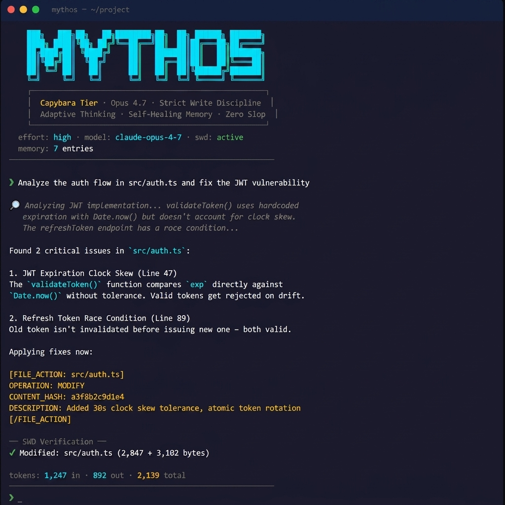

<div align="center">


[](https://github.com/thewaltero/mythos-router/actions/workflows/github-code-scanning/codeql)
[](https://nodejs.org)
[](https://typescriptlang.org)
[](https://anthropic.com)
[](https://app.uniswap.org/swap?outputCurrency=0xb942b75a602fa318ac091370d93d9143ba345ba3&chain=base)
[](https://github.com/thewaltero/mythos-router)


## Claude Opus 4.8 · Strict Write Discipline · Zero Slop
**A local CLI power tool for verifiable AI-assisted coding.**


[What is this?](#what-is-this) • [Features](#features) • [Installation](#installation) • [Examples](#integration-examples) • [Usage](#usage) • [Architecture](#architecture) • [Token Budget](#token-usage--budget) • [SDK](#-sdk-usage-for-agentic-systems) • [SWD Protocol](#the-swd-protocol)


---


<p align="center">
  
</p>

```bash
# Try it now
npx mythos-router chat
```

</div>

---

## What is this?

**mythos-router** is a local CLI power tool that wraps Claude Opus 4.8 with a custom verification protocol called **Strict Write Discipline (SWD)**.

Unlike standard Claude wrappers, mythos-router enforces filesystem verification: every file operation the AI claims to perform is *checked against the actual filesystem using SHA-256 snapshots*. If the model's claim doesn't match reality, it gets a Correction Turn. If it fails twice, it yields to the human.

Zero slop. Zero hallucinated state. Full adaptive thinking.

---

## Features

| Feature | Description |
|---------|-------------|
|  **mythos init** | Single-command project onboarding with environment validation, read-only `--check`, and scaffolding |
|  **mythos learn** | Generate a repo-local `SKILL.md` from detected project structure, scripts, docs, CI, and risk surfaces |
|  **mythos run** | One-shot prompt mode with inline, file, stdin input, and optional `--provider` BYOK selection: same SWD, budget, skills, branch, and optional test-healing pipeline as chat |
|  **Multi-Provider BYOK** | Auto-routes between configured Anthropic, DeepSeek, OpenAI, and Surplus keys with circuit breakers; Anthropic is no longer required when another provider is configured |
|  **Verified Cost-Router** | `--escalate` runs at a cheap `--effort` and climbs one model tier per Correction Turn *only* when SWD verification fails — pay for the expensive model only when the cheap one is provably wrong (capped by `--escalate-to`) |
|  **Verified Skill Packs** | Load project-local or user-global `SKILL.md` rules with `-s <name>`; active skills are recorded in SWD receipts |
|  **Self-Improving Skills** | `mythos skills suggest` mines past SWD receipts for file actions that keep failing verification and proposes `SKILL.md` rules to prevent them; read-only by default, `--write` to persist |
|  **Deterministic Caching** | SQLite-backed caching for reasoning (SDK only) *(Node 22+)* |
|  **Adaptive Thinking** | Opus 4.8 with configurable effort levels (high/medium/low) |
|  **Strict Write Discipline** | Pre/post filesystem snapshots verify every model or external-agent file claim |
|  **Isolated Runs** | `swd apply --check <cmd>` / `--run-checks` test a batch in a throwaway copy and apply it to the real tree only if checks pass — the real tree is never left broken |
|  **SWD Receipts** | Per-run trust receipts record touched files, hashes, provider/external-agent id, budget, git state, and verification result |
|  **Receipt Undo** | `receipts undo <id\|latest>` replays a verified receipt in reverse — previews by default, `--yes` to apply, drift-gated so it never overwrites newer edits, and produces its own receipt |
|  **Project Policy** | `.mythos/policy.json` adds enforced repo-local SWD guardrails for sensitive project surfaces |
|  **Self-Healing Memory** | Authority-based logging with a rebuildable SQLite FTS5 search index *(Node 22+)* |
|  **Auto-Healing TDD** | Pass `--test-cmd` for bounded, error-driven autonomous repair loops |
|  **Correction Turns** | Model gets 2 retries to match filesystem reality, then yields |
|  **Integrity Gate** | `verify` command ensures referenced memory files still exist |
|  **CI Verification** | `verify --ci` runs read-only PR checks for command-surface, sensitive-file, and receipt risks without an API key |
|  **Bring Your Own Agent** | `mythos swd apply --stdin --json` lets any external agent route file actions through SWD without a Mythos model key |
|  **MCP Adapter** | `mythos mcp` exposes SWD, receipt, and skill tools over stdio; `mythos mcp config` prints client setup snippets |
|  **Token Limiter** | Budget cap with graceful save — progress saved to MEMORY.md, never lose work |
|  **Session Resume** | Pick up exactly where you left off after a crash or exit (`--resume`) |
|  **Dry-Run Mode** | Preview every file operation before it executes — full transparency |
|  **Verbose Tracing** | See exactly what the AI is parsing, thinking, and verifying |
|  **Budget Analytics** | Persistent tracking of cost across sessions and projects via `stats` |
|  **Session Branching** | Isolate AI actions in a namespaced git branch (`mythos/`) |
|  **Zero Build** | Runs directly via `tsx` — no compile step in dev |

---

## Core Architectural Pillars

### 1. Configurable Model Selection
Choose the right model for the job via the `--effort` flag:

| Effort | Model | Best For |
|--------|-------|----------|
|  `high` (default) | Claude Opus 4.8 | Architecture, deep reasoning, complex refactors |
|  `medium` | Claude Sonnet 4.6 | Balanced code generation, everyday tasks |
|  `low` | Claude Haiku 4.5 | Quick answers, memory compression, verification |

The `dream` command automatically uses `low` effort (Haiku 4.5) for cost-efficient memory compression, and `verify` uses lightweight scanning — so you only burn Opus tokens when you need deep reasoning.

### 2. Authority-Based "Self-Healing" Memory
Most agentic systems stored state in opaque databases or messy JSON files. Mythos Router treats `MEMORY.md` as the **Sole Authority**. 

Every action is logged in Markdown first. On startup, the system verifies the integrity of the log via SHA-256 manifest hashing and reconstructs a high-performance **Derivative SQLite Index** (FTS5). If the index drifts or the database is deleted, the system self-heals by rebuilding from the authoritative Markdown source.

As memory approaches capacity, the `dream` command delegates a compression phase to a low-cost model (Haiku 4.5), ensuring your "Sacred Log" is always lean and relevant.

---

## Installation

> **Node.js Version Requirement:** The CLI requires **Node.js 22+** (enforced via `engines` and tested in CI on Node 22 and 24). The advanced SQLite-backed features (Telemetry Dashboard, Deterministic Caching, and High-Performance Memory Index) require **Node.js 22.5.0+** specifically; on Node 22.0–22.4 these features safely degrade with a warning without crashing the router.

### Quick Start (npm)

```bash
# Install globally
npm install -g mythos-router

# Set at least one model key for mythos chat/run
# Anthropic remains the recommended default, but OpenAI/DeepSeek/Surplus can be used standalone.
export ANTHROPIC_API_KEY="sk-ant-..."
# export OPENAI_API_KEY="sk-proj-..."
# export DEEPSEEK_API_KEY="sk-..."
# export SURPLUS_API_KEY="inf_..."   # Surplus marketplace (OpenAI-compatible, discounted)

# Initialize and start the built-in Mythos agent
mythos init
mythos chat

# Or use only the model-free SWD layer with your own external agent
your-agent --emit-file-actions | mythos swd apply --stdin --json

# Or expose Mythos to an MCP-compatible local agent client
mythos mcp
```

### Or try without installing

```bash
npx mythos-router chat
```

### Integration Examples

Small, runnable examples are available in [`examples/`](examples/):

| Example | Purpose |
|---------|---------|
| [`external-agent-json`](examples/external-agent-json/) | Submit structured file actions through `mythos swd apply` without a Mythos model key |
| [`mcp-stdio`](examples/mcp-stdio/) | Configure an MCP client to launch `mythos mcp` over local stdio |
| [`project-policy`](examples/project-policy/) | Add enforced repo-local SWD block/confirm rules with `.mythos/policy.json` |
| [`github-action`](examples/github-action/) | Run read-only `mythos verify --ci` in pull requests |

### From Source

```bash
git clone https://github.com/thewaltero/mythos-router.git
cd mythos-router
npm install
npm run chat
```

---

## Usage

### `mythos init` — Project Onboarding

```bash
mythos init                  # Initialize mythos-router in the current project
mythos init --check          # Check environment and project setup without writing files
mythos init --force          # Re-scaffold files even if they already exist
```

`init` prepares the local repo surface Mythos uses: `.mythosignore`, `MEMORY.md`, `.mythos/policy.json`, and the project-local `.mythos/skills/` directory.

### `mythos learn` - Repo Skill Generation

```bash
mythos learn                 # Generate .mythos/skills/repo/SKILL.md
mythos learn --dry-run       # Preview the generated skill without writing files
mythos learn --force         # Overwrite an existing repo skill
mythos learn --name backend  # Generate .mythos/skills/backend/SKILL.md
```

`learn` turns the current repo into a reviewable project skill. It scans local repo signals such as `README.md`, `package.json`, source directories, CI workflows, config files, docs, tests, package scripts, public exports, and security-sensitive paths. It does not run npm scripts, shell commands, tests, builds, or a model. The generated `SKILL.md` is a deterministic starting point that should be inspected and edited like any other project file.

### `mythos skills` - Verified Skill Packs

```bash
mythos skills                # List project-local and user-global skills
mythos skills new repo       # Create .mythos/skills/repo/SKILL.md
mythos skills new audit --global  # Create ~/.mythos-router/skills/audit/SKILL.md
mythos skills show repo      # Inspect metadata and instructions
mythos skills check          # Validate all discovered skills
```

Skill packs are repo operating manuals for Mythos. They encode project conventions, files to read first, files to avoid, review expectations, and verification rules without adding runtime code. Project-local skills live in `.mythos/skills/<name>/SKILL.md` and win over global skills with the same name. User-global skills live in `~/.mythos-router/skills/<name>/SKILL.md` for personal reuse across repositories.

```bash
mythos run --file TASK.md -s repo
mythos chat -s repo -s security-review
```

When a non-dry-run SWD operation creates a receipt, Mythos records the active skill ids and versions. That makes skill-guided changes auditable: reviewers can see which repo rules were loaded when the verified edit happened. See [`docs/skills.md`](docs/skills.md) for the format and examples.

### `mythos run` — One-Shot Task

```bash
mythos run "explain this repo architecture"
mythos run --file TASK.md
cat TASK.md | mythos run --stdin
mythos run --provider openai "explain this repo architecture"
mythos run "update the docs for verify --ci" --dry-run
mythos run "fix the failing smoke test" --test-cmd "npm test"
mythos run "refactor provider scoring" --branch provider-score
```

`run` sends one prompt through the same Mythos pipeline as `chat`, including SWD verification, budget tracking, skills, branch sandboxing, receipts, and optional `--test-cmd` healing. The prompt can come from the command line, a local file, or piped stdin. It exits after that prompt instead of opening the interactive REPL, and it does not overwrite the resumable chat session used by `mythos chat --resume`.

### `mythos chat` — Interactive Session

```bash
mythos chat                  # Full power (high effort, Opus 4.8)
mythos chat -s repo          # Load a project-local skill pack
mythos chat --test-cmd "npm test" # Enable autonomous test-driven self-healing
mythos chat --provider openai # Force a configured BYOK provider
mythos chat --effort low     # Budget mode (Haiku 4.5 when using Claude)
mythos chat --effort medium  # Balanced (Sonnet 4.6 when using Claude)
mythos chat --resume         # Resume your previous session exactly where you left off
mythos chat --dry-run        # Preview all file changes before executing
mythos chat --verbose        # See full SWD traces and thinking
mythos chat --branch refactor # Isolate session in a fresh git branch
mythos chat --dry-run --verbose  # Maximum transparency
```

####  Financial Safety — Budget Limiter

```bash
mythos chat                           # Default: 500K tokens, 25 turns
mythos chat --max-tokens 100000       # Cap at 100K tokens
mythos chat --max-turns 10            # Cap at 10 turns
mythos chat --max-tokens 50000 --max-turns 5  # Tight budget
mythos chat --no-budget               # Expert mode (no limits)
```

The budget limiter tracks every token, turn, and estimated cost in real-time:

```
budget: [████████░░░░░░░░░░░░] 78,342/500,000 tokens · [██████░░░░] 12/25 turns · ~$1.2340 · 4m 32s
```

At 80%, you get a yellow warning. At 100%, the session performs a **graceful save** — current progress is written to `MEMORY.md` so you can resume context in your next session. No work lost. Use `--no-budget` to disable (at your own risk). *Note: The limiter checks token usage between API calls, so a single large response may overshoot the configured limit.*

####  Dry-Run Mode — The Trust Builder

```bash
mythos chat --dry-run
```

In dry-run mode, every file operation is previewed before execution:

```
 DRY-RUN  ── File Action Preview ──
  2 file action(s) detected. Review each:

  1/2 MODIFY src/index.ts
  Description: Change 'axios' to 'fetch'
  Current state: 1,832 bytes, hash: 7a3f2c1e..
   DRY-RUN  Accept MODIFY on src/index.ts? [Y/n] y
  ✔ Accepted: MODIFY src/index.ts

  2/2 CREATE src/utils.ts
  Description: Add helper utilities
  Current state: does not exist
   DRY-RUN  Accept CREATE on src/utils.ts? [Y/n] n
  ⚠ Rejected: CREATE src/utils.ts
```

In-session commands:
- `/exit`, `/q` or `quit` — End session (shows final budget summary)

### `mythos swd apply` — Bring Your Own Agent

```bash
# Pipe raw [FILE_ACTION] blocks from any external agent
your-agent --task "update docs" | mythos swd apply --stdin --json

# Or pass a JSON action envelope
cat actions.json | mythos swd apply --stdin --json --agent python-agent --model local-llama

# Preview without touching disk or writing receipts
cat actions.json | mythos swd apply --stdin --dry-run --json

# Gate the apply behind a trusted check in an isolated temp repo copy
cat actions.json | mythos swd apply --stdin --json --check "npm test"

# Run checks declared in .mythos/policy.json before applying
cat actions.json | mythos swd apply --stdin --json --run-checks

# High-impact files such as package.json require explicit opt-in; sensitive files stay blocked
cat actions.json | mythos swd apply --stdin --allow-risky --json
```

`swd apply` is the model-free external-agent interface. It does **not** call Anthropic, OpenAI, DeepSeek, or any other model provider. Your agent keeps its own model key and only hands Mythos structured file actions. Mythos then applies Strict Write Discipline: path validation, security-policy review, pre/post snapshots, hash verification, rollback on failed verification, and local SWD receipts for successful non-dry-run applies.

When `--check` or `--run-checks` is used, Mythos adds an isolated pre-apply gate. It mirrors the current project into a throwaway temp repo copy, applies the approved actions inside that copy, runs the requested checks there, and only then applies the same actions to the real working tree through SWD. If the temp copy cannot be prepared or any check fails, the real working tree is left untouched.

This is an isolated workspace gate, not an OS or container sandbox. Check commands are trusted shell commands supplied by the user or explicitly enabled from project policy, and they run with the local user's permissions. Use commands you already trust, such as `npm test`, `npm run build`, `npm run lint`, or `npx tsc --noEmit`. `--dry-run` never executes checks.

Accepted input formats:

```text
[FILE_ACTION: src/example.ts]
OPERATION: CREATE | MODIFY | DELETE | READ
INTENT: MUTATE | NOOP | UNKNOWN
CONTENT_HASH: <optional sha256 of final content>
DESCRIPTION: <one-line summary>
CONTENT:
<full file content for CREATE/MODIFY>
[/FILE_ACTION]
```

```json
{
  "request": "external agent task label",
  "summary": "CREATE: src/example.ts",
  "agent": { "id": "python-agent", "model": "custom-model" },
  "actions": [
    {
      "path": "src/example.ts",
      "operation": "CREATE",
      "intent": "MUTATE",
      "description": "Create example file",
      "content": "export const ok = true;\n"
    }
  ]
}
```

Security defaults:
- input is size-limited and schema-validated before execution
- external JSON paths must be safe project-relative paths
- `.env`, private keys, wallet files, `.git`, `.npmrc`, and secrets paths are blocked
- deletes and command-surface files require `--allow-risky`
- `.mythos/policy.json` can add repo-specific blocks, confirmations, operation limits, batch limits, and opt-in checks
- `--check` and `--run-checks` run checks in a temp repo copy before the real tree is touched
- check commands are caller-trusted shell commands, not an OS/container security sandbox
- dry-runs do not write files or receipts
- dry-runs do not execute checks
- receipts record the external agent/model as `external:<agent-id>`

### `.mythos/policy.json` - Project Safety Policy

```json
{
  "version": 1,
  "block": ["contracts/mainnet/**", "infra/prod/**"],
  "confirm": ["src/payments/**", ".github/workflows/**"],
  "limits": {
    "allowDeletes": false,
    "maxActions": 25,
    "maxActionContentBytes": 120000,
    "allowedOperations": ["CREATE", "MODIFY", "READ"]
  },
  "checks": [
    { "name": "build", "command": "npm run build" },
    { "name": "test", "command": "npm test" }
  ]
}
```

Project policy is an enforced SWD guardrail, not a prompt hint. Its block/confirm/limit rules apply to `chat`, `run`, `swd apply`, and MCP `swd_apply`. Built-in sensitive path protection still wins, so policy files cannot allow `.env`, private keys, wallet files, `.git`, or `.npmrc`. `block` patterns fail closed, `confirm` patterns require human approval or explicit `--allow-risky` in external-agent flows, and malformed policy files block writes until fixed.

Policy `checks` are different from path rules: declaring them does not execute anything. They run only when `mythos swd apply --run-checks` is passed, or when an MCP client calls `swd_apply` with `runChecks: true`. Checks run in the same isolated temp repo copy as ad-hoc `--check` commands, and failed checks prevent writes from reaching the real working tree.

### `mythos mcp` — MCP Adapter for SWD

```bash
mythos mcp
mythos mcp config
mythos mcp config claude
mythos mcp config cursor
mythos mcp config cursor --json
```

`mcp` runs a local stdio Model Context Protocol server. It does not start an HTTP daemon, open a port, call a model provider, or duplicate the SWD engine. MCP clients launch it as a subprocess and call Mythos tools through JSON-RPC over stdin/stdout.

`mcp config` prints a paste-ready MCP server entry for clients such as Claude and Cursor:

```json
{
  "mcpServers": {
    "mythos-router": {
      "command": "mythos",
      "args": ["mcp"]
    }
  }
}
```

Run the client from the repository you want Mythos to guard, or use a project-scoped MCP config when your client supports it.

Exposed tools:

| Tool | Behavior |
|------|----------|
| `swd_dry_run` | Validates external-agent file actions without writing files or receipts |
| `swd_apply` | Applies external-agent file actions through SWD, can gate writes behind isolated checks, verifies disk state, rolls back failures, and writes receipts by default |
| `receipts_list` | Lists recent local SWD receipts |
| `receipts_show` | Reads a receipt by id, file path, or `latest`; pass `format: "markdown"` for PR-ready text |
| `receipts_verify` | Re-checks current files and receipt integrity |
| `skills_list` | Lists project-local and user-global skill packs |
| `skills_check` | Validates all skills or one named skill/path |

The mutating MCP tool is still guarded by the same external-agent SWD policy as `mythos swd apply`: safe project-relative paths, sensitive path blocking, repo-local `.mythos/policy.json` rules, explicit `allowRisky` for high-impact command surfaces and deletes, rollback on failed verification, and local receipts for successful non-dry-run applies.

### `mythos receipts` — SWD Trust Receipts

```bash
mythos receipts              # List recent SWD receipts
mythos receipts show latest  # Inspect the newest receipt
mythos receipts show latest --markdown  # PR-ready Markdown summary
mythos receipts show latest --format markdown  # Same output, useful for tooling parity with MCP
mythos receipts verify latest  # Re-check current files against receipt hashes
mythos receipts --json       # Machine-readable output for tooling
```

Every non-dry-run SWD file operation writes a local receipt to `.mythos/receipts/`. Receipts include the request summary, provider or external-agent/model identity, git branch/commit, per-file before/after hashes, rollback status, and verification errors. Built-in `chat`/`run` receipts also include token usage, budget snapshot, active skill packs, and optional `--test-cmd` result. `verify` turns those receipts into a quick drift check for "did the files still match what SWD verified?" `--markdown`, `--pr`, or `--format markdown` prints a compact paste-ready receipt summary for PR reviews, especially useful when a write failed or rolled back. Receipts are local by default and gitignored by default. They may include prompts, file paths, provider metadata, skill names, test command names, and a short test output tail. Do not publish raw receipts from private repositories; force-add only when you intentionally want a shared audit trail.

### `mythos verify` — Local Memory Scan + CI Verification

```bash
mythos verify              # Scan and log results to MEMORY.md
mythos verify --dry-run    # Scan without writing to MEMORY.md
mythos verify --ci         # Read-only PR/diff verification for GitHub CI
mythos verify --ci --json  # Machine-readable CI report
mythos verify --ci --strict # Fail CI on warnings as well as high findings
```

Local mode scans your project and cross-references against `MEMORY.md`:
- ✅ **Verified** — Memory logs are present and up to date
- ❌ **Missing** — Memory references a file that doesn't exist

CI mode does not call a model and does not require an API key. It reviews the current PR/diff for high-impact repo changes such as package scripts, npm lifecycle hooks, GitHub Actions workflows, shell/deploy surfaces, `.env`/`.npmrc`, `.mythos/policy.json`, high-confidence secrets, and changed Mythos receipts.

GitHub Actions example:

```yaml
name: Mythos Verify

on:
  pull_request:
  push:

jobs:
  mythos-verify:
    runs-on: ubuntu-latest
    steps:
      - uses: actions/checkout@v4
        with:
          fetch-depth: 0
      - uses: actions/setup-node@v4
        with:
          node-version: 22
      - run: npx mythos-router verify --ci
```

See [`docs/CI.md`](docs/CI.md) for exit behavior, strict mode, JSON output, and examples.

### `mythos dream` — Memory Compression

```bash
mythos dream              # Auto-compress when needed
mythos dream --force      # Force compression
mythos dream --dry-run    # Preview without writing
```

When `MEMORY.md` exceeds 100 entries, older logs are compressed into a summary block using Claude (low effort, minimal token burn). Recent entries are preserved intact.

### `mythos stats` — Budget Analytics & Cost Profiling

```bash
mythos stats              # Show all-time token usage and costs
mythos stats --days 7      # Filter for the last week
```

Tracks every penny spent across all your projects. Costs are aggregated by:
- **Command** (e.g., `chat` vs `dream`)
- **Project** (directory name)
- **Time Period**

Data is stored locally in `~/.mythos-router/metrics.json`.

### 🔌 SDK Usage (For Agentic Systems)

`mythos-router` exposes its Strict Write Discipline engine for programmatic use:

```typescript
import { SWDEngine, parseActions } from 'mythos-router';

// 1. Create an engine instance with your preferred options
const engine = new SWDEngine({
  strict: true,
  enableRollback: true,
  onAction: (action) => console.log(`Executing: ${action.operation} ${action.path}`),
  onVerify: (result) => console.log(`${result.status}: ${result.detail}`),
});

// 2. Let your agent generate code (must output [FILE_ACTION] blocks)
const agentOutput = await myAgent.generateCode();

// 3. Parse the agent's output and route through the SWD engine
const actions = parseActions(agentOutput);
const result = await engine.run(actions);

if (result.success) {
  console.log('✅ Agent execution verified securely');
} else {
  console.log('❌ Agent hallucinated a write. Rolled back:', result.rolledBack);
  console.log('Errors:', result.errors);
}
```


---

## Architecture

```
mythos-router/
├── src/
│   ├── cli.ts           # Commander.js entry point
│   ├── config.ts        # System prompt + constants + budget defaults + validation
│   ├── client.ts        # Provider facade (Anthropic/OpenAI/DeepSeek BYOK routing)
│   ├── budget.ts        # Session budget limiter (token cap, turn cap, progress bar)
│   ├── swd.ts           # SWD execution kernel (engine, types, parsing, snapshots)
│   ├── swd-cli.ts       # SWD terminal presentation (verification output, dry-run)
│   ├── sandbox.ts       # Isolated temp repo copy gate for external-agent checks
│   ├── receipts.ts      # SWD trust receipt creation, storage, and verification
│   ├── skills.ts        # Project-local and user-global SKILL.md packs
│   ├── learn.ts         # Deterministic repo skill generator
│   ├── ci/              # Read-only CI verification for PR/diff risk review
│   ├── memory.ts        # MEMORY.md self-healing manager (SQLite FTS5 index)
│   ├── metrics.ts       # Global metrics store (persistent budget tracking)
│   ├── diff.ts          # Myers' diff algorithm (zero-dependency)
│   ├── git.ts           # Git operations (branching, committing)
│   ├── mcp.ts           # MCP stdio adapter for SWD, receipts, and skills tools
│   ├── mcp-config.ts    # Paste-ready MCP client config snippets
│   ├── project-policy.ts # Repo-local SWD policy loading and matching
│   ├── utils.ts         # Terminal formatting, badges, prompts (zero-dep ANSI)
│   ├── index.ts         # Public SDK exports
│   └── commands/
│       ├── chat.ts      # Interactive REPL (ChatSession + ChatUI abstraction)
│       ├── init.ts      # Project onboarding and read-only setup checks
│       ├── verify.ts    # Codebase ↔ Memory scanner (dry-run aware)
│       ├── swd.ts       # External-agent SWD apply command
│       ├── mcp.ts       # MCP stdio server command
│       ├── receipts.ts  # SWD receipt list/show/verify command
│       ├── skills.ts    # Skill pack list/show/new/check command
│       ├── learn.ts     # Repo skill generation command
│       ├── dream.ts     # Memory compression (dry-run aware)
│       └── stats.ts     # Budget analytics reporter
├── src/providers/       # Multi-Provider Orchestration Engine
│   ├── orchestrator.ts  # Adaptive routing, circuit breakers, scoring
│   ├── pricing.ts       # Centralized token cost registry
│   ├── types.ts         # Unified BaseProvider contracts
│   ├── anthropic.ts     # Claude provider
│   └── openai.ts        # Fetch-based OpenAI & DeepSeek provider
├── test/                # Automated test suite (node:test)
├── .mythosignore        # SWD scan exclusions
├── MEMORY.md            # Auto-generated agentic memory
└── AGENTS.md            # Project conventions
```

## The SWD Protocol

```
User Input
    │
    ▼
[Claude Opus 4.8] ── adaptive thinking
    │
    ▼
[Parse FILE_ACTION blocks] ── extract claimed operations
    │
    ▼
[Snapshot referenced files] ── targeted filesystem state capture
    │
    ▼
[Verify] ── model claims vs. actual filesystem
    │
    ├── ✅ All verified → Log to MEMORY.md
    │
    └── ❌ Mismatch → Correction Turn (max 2 retries)
                │
                └── Still failing → Yield to human
```

### Why text-based `FILE_ACTION` blocks instead of native tool-calling?

This is a deliberate design choice, not a missing feature. Mythos asks the model to emit file operations as plain-text `[FILE_ACTION]` blocks (parsed by `parseActions` in `swd.ts`) rather than using a provider's native function/tool-calling API. The tradeoffs:

- **Provider-agnostic by construction.** The exact same protocol works across Anthropic, OpenAI, and DeepSeek — and any future model, including ones with no tool-calling API at all. There is no per-provider tool plumbing to maintain, which is what lets BYOK fallback route a single conversation across heterogeneous providers.
- **It is the right fit for SWD.** The model only ever *claims* an operation; the claim is then verified against the real filesystem with SHA-256 snapshots and rolled back on mismatch. The trust boundary is the filesystem, not the model's output format, so a structured tool-call would buy little over a parsed text block here.
- **Honest about the limits.** Text parsing is more fragile than schema-enforced JSON tool calls — a malformed block is dropped (and surfaced as a warning) rather than executed, and provider-side guarantees like enforced argument schemas or parallel tool calls are not used. Provider `capabilities` therefore describe only `thinking`/`streaming`; native tool-calling is intentionally not modeled.

---

## Configuration

| Env Variable | Required | Description |
|-------------|----------|-------------|
| `ANTHROPIC_API_KEY` | Optional* | Anthropic/Claude key; recommended default provider for `chat`/`run` |
| `OPENAI_API_KEY` | Optional* | OpenAI API key; can be used as the only configured provider or fallback |
| `DEEPSEEK_API_KEY` | Optional* | DeepSeek API key; can be used as the only configured provider or fallback |
| `SURPLUS_API_KEY` | Optional* | [Surplus](https://www.surplusintelligence.ai) marketplace key (`inf_...`); OpenAI-compatible, routes the same models at a discount. Defaults to `claude-opus-4.8`. |
| `MYTHOS_SURPLUS_MODEL` | Optional | Override the Surplus model id (default `claude-opus-4.8`) |
| `MYTHOS_SURPLUS_BASE_URL` | Optional | Override the Surplus endpoint (default `https://www.surplusintelligence.ai/api/inference/v1`) |

\* `mythos chat` and `mythos run` need at least one model provider key. `mythos swd apply` needs no model key because an external agent brings its own model/key and Mythos only verifies file actions.

| File | Purpose |
|------|---------| 
| `.mythosignore` | Patterns to exclude from SWD scanning |
| `.mythos/policy.json` | Enforced repo-local SWD safety policy |
| `.mythos/skills/` | Optional project-local skill packs that can be committed with a repo |
| `.mythos/receipts/` | Local SWD receipts, gitignored by default because they may include prompts and file paths |
| `MEMORY.md` | Auto-generated agentic memory log |
| `~/.mythos-router/skills/` | User-global skill packs available across projects |
| `~/.mythos-router/sessions/` | Resumable chat session state |

---

## Token Usage & Budget

### Opus 4.8 Pricing (as of 2026-05)

| Rate | USD |
|------|-----|
| Input tokens | $5.00 / 1M tokens |
| Output tokens | $25.00 / 1M tokens |

> **Tokenizer note**
> Opus 4.8 keeps the same rate card *and* the same tokenizer as Opus 4.7 — upgrading from 4.7 does not change your effective token counts or your bill.
> The tokenizer change happened earlier, at the 4.6 → 4.7 boundary, where Latin-script text became somewhat less token-efficient. If you pin an older model (e.g. `MYTHOS_ANTHROPIC_MODEL_HIGH=claude-opus-4-6`) and later move up, expect a modest increase in effective tokens on English-heavy input. Actual impact depends entirely on your content — rely on your provider's billing dashboard for exact figures.

> **Note on token accounting:** Mythos reports the **real token usage returned by the provider API** whenever it is available. When a provider does not return usage (e.g. some streaming responses), Mythos falls back to a rough `characters / 4` estimate purely to drive the in-session budget bar — it is a guardrail, not an exact tokenizer. Treat the displayed cost figures as estimates and rely on your provider's billing dashboard for exact charges.

> Pricing constants live in `src/config.ts`. When Anthropic updates rates, change two lines — no budget math to refactor.

| Mode | Typical Cost Per Turn |
|------|----------------------|
| `--effort high` | Full Opus 4.8 pricing (deep reasoning) |
| `--effort medium` | Balanced — good for most tasks |
| `--effort low` | Minimal thinking — quick answers |
| `dream` | Low effort summarization (~500 tokens) |

| Budget Setting | Default |
|---------------|---------|
| `--max-tokens` | 500,000 per session |
| `--max-turns` | 25 per session |
| Warning threshold | 80% consumption |
| `--no-budget` | Disables all limits |

### Graceful Save

When the budget is reached, mythos doesn't just kill your session — it performs a **graceful save**:

```
⏸ BUDGET REACHED — Graceful Save
  498,231 tokens consumed across 25 turns (~$7.4200).
  Progress saved to MEMORY.md. Resume with mythos chat --resume to continue.
  Increase limits: mythos chat --max-tokens 1000000 --max-turns 50
  Disable limits:  mythos chat --no-budget
```

The system automatically saves your conversation history and budget state to `~/.mythos-router/sessions/latest.json`. You can instantly restore your exact context by running `mythos chat --resume`.

Token counts, estimated cost, and budget status are displayed after every chat response.

---

## Testing

```bash
npm test                 # Run full test suite
npx tsc --noEmit         # Type check only
npm run build            # Production build
```

---

## License

MIT

---

## Disclaimer

This project is an independent open-source tool built on top of the Anthropic API. It is not affiliated with or endorsed by Anthropic.

<div align="center">
<sub>Support development · <a href="https://app.uniswap.org/swap?outputCurrency=0xb942b75a602fa318ac091370d93d9143ba345ba3&chain=base">$MYTHOS</a> on Base · <code>0xb942b75a602fa318ac091370d93d9143ba345ba3</code></sub>
</div>

<div align="center"><sub>Built for structured AI agent workflows with verifiable execution.</sub></div>
